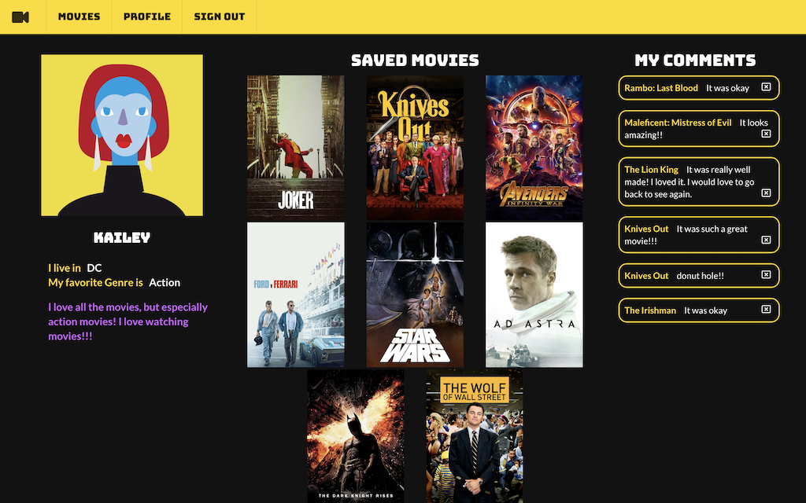

## Movie Hangout frontend
Movie Hangout is a single page web application where you can see details of movies and find the most popular and rated movies at the current moment. You can share your thoughts about the movie by leaving comments and save the movies that you like under your favorite list!

### This is a repository for Movie Hangout's frontend:
 - designed with Javascript and React
 - importing up-to-date data from THE MOVIE DB APIs by fetching to the backend
 - has full validations and authentication with JWT token
 - styled with Semantic UI framework and custom CSS
 - including multiple search and sort functions: search by keyword, sort by genre, name, and rating
 
### To start the whole application, please clone the backend as well
  you can find it at: https://github.com/Nihaprezz/movie-hangout-backend

### To start this frontend repository:
 1. open and run 'npm install'
 2. run 'npm start'

#### To see a full demo, please look at: https://youtu.be/1b3oMjhPK3U
   

